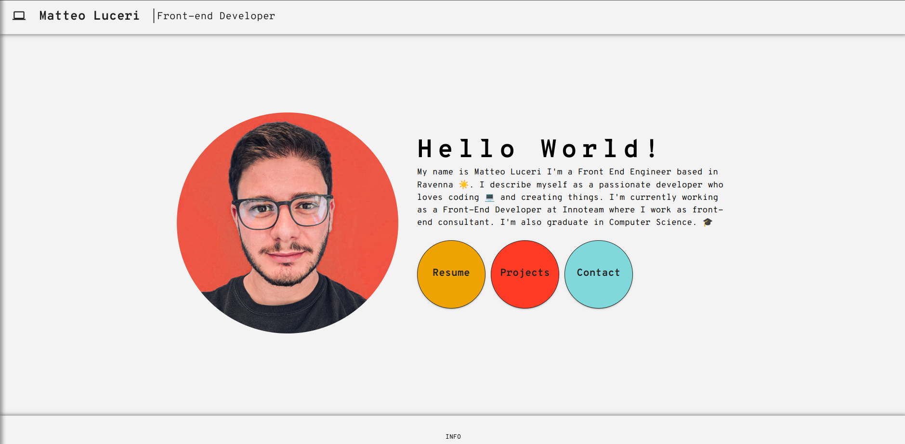

# matteoluceri.info

I started making this site a bit for fun and a bit to test my skills, using my site as a small laboratory to experiment.

Some bullets :

- VIteJs

- React

- Typescript

- Material UI + Styled Components

- React Router

- React Hook Form

- EmailJS (to send e-mail without a back-end)

- React Toastify

- Surge (for hosting)

- Design ispired to: [CV creativo Template | WIX](https://it.wix.com/website-template/view/html/2846?originUrl=https%3A%2F%2Fit.wix.com%2Fwebsite%2Ftemplates%2Fhtml%2Fportfolio-cv&tpClick=view_button&esi=7f15195a-0540-42af-889b-aa3324d7b44e)

- I wanted to use i18n, but out of laziness I opted for a `utils / getCopy.ts` function which returns all the texts on the site
